<div align="center">



<br><br>
[](mailto:tharompanha1@gmail.com)
[](tel:+85570479381)
[](https://github.com/tharompanha1-ops)


</div>

<br>

## `$` about me

```
> **SCHOOL**:វិទ្យាល័យសុខអានថ្នល់បំបែក
> I am a student interested in computer scientist, programming and technology.
> I enjoy learning new technologies and creating useful digital projects.
> languages:Khmer — native / English — elementary 
```
<br>

## `$` skills --list

```
HTML        ████████████████░░░░  80%
CSS         ███████████████░░░░░  75%
JavaScript  ███░░░░░░░░░░░░░░░░░  15%
Python      ████░░░░░░░░░░░░░░░░  20%
```

<div align="center">


</div>
</td>
</tr>
</table>

<br>

## `$` projects 

<table>
<tr>
<td width="50%" valign="top">

### 📚 education-website
An educational website designed to help students learn more effectively.

</td>
<td width="50%" valign="top">

### 🗂️ student-management
A simple web project for managing student information and results.

</td>
</tr>
<tr>
<td width="50%" valign="top">

### 🤖 ai-project
A project exploring how AI can solve real-world problems.

</td>
<td width="50%" valign="top">

### 🌐 portfolio-website
Personal portfolio website built with HTML, CSS and JavaScript.

</td>
</tr>
</table>

<br>
<div align="center">
- Check out my pinned repositories on my profile for a look at recent work.
</div>
<br>

<div align="center">

[](mailto:tharompanha1@gmail.com)
[](https://github.com/tharompanha1-ops)

<sub><code>&gt; thanks for visiting my profile_</code></sub>

</div>
